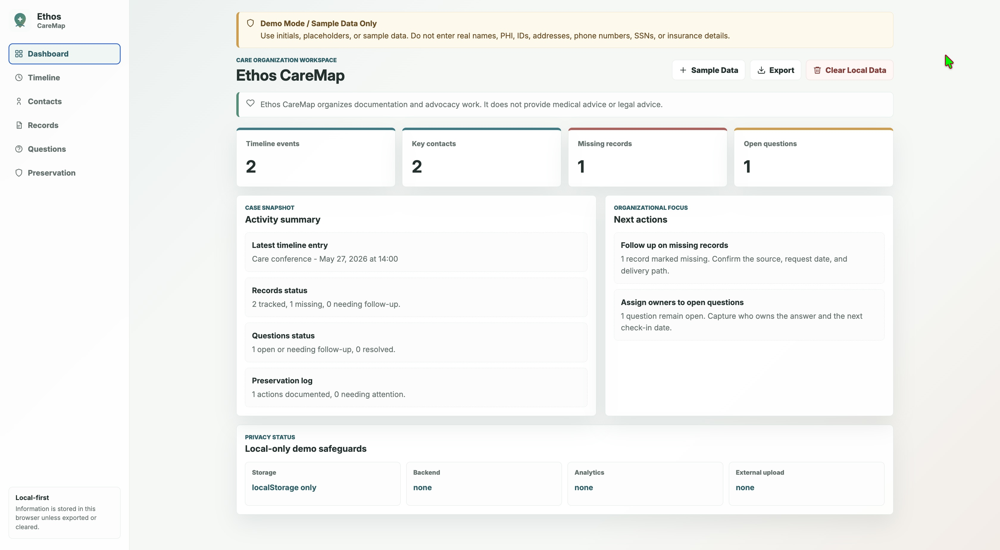
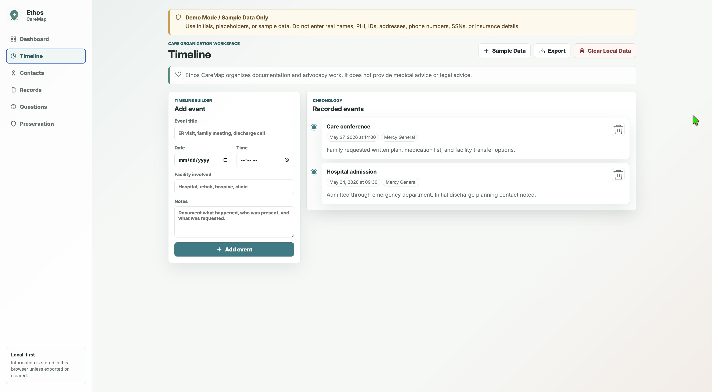
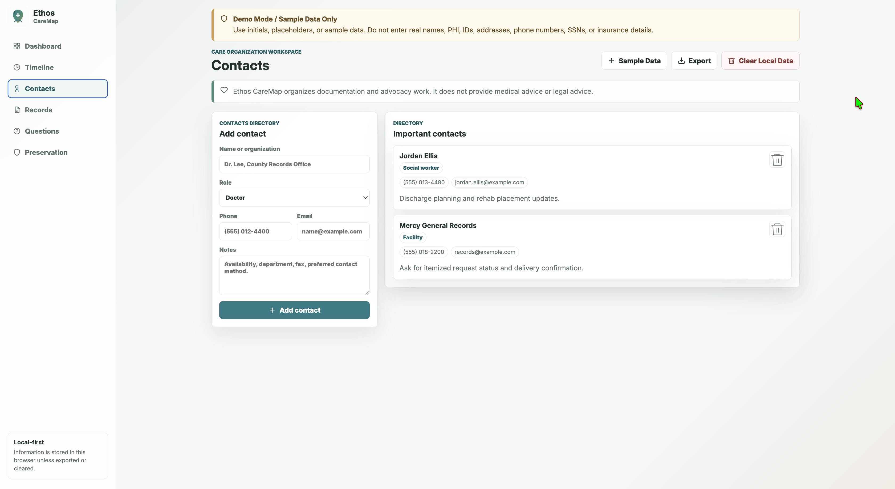
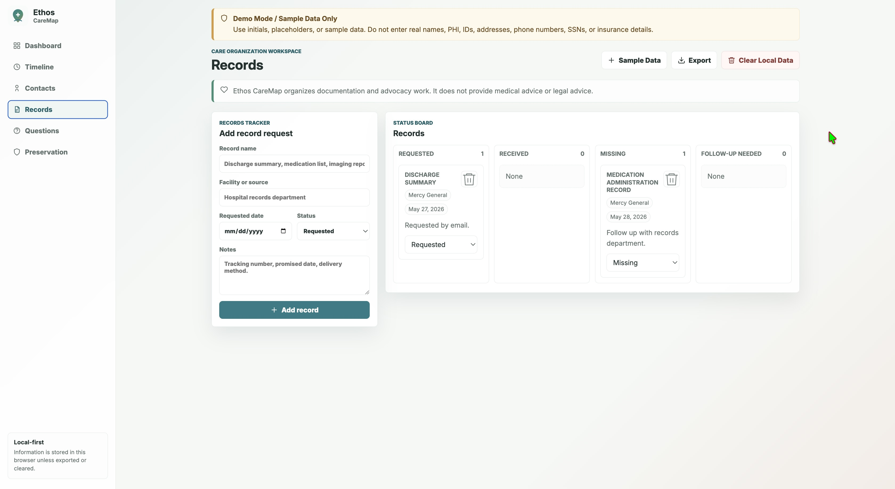
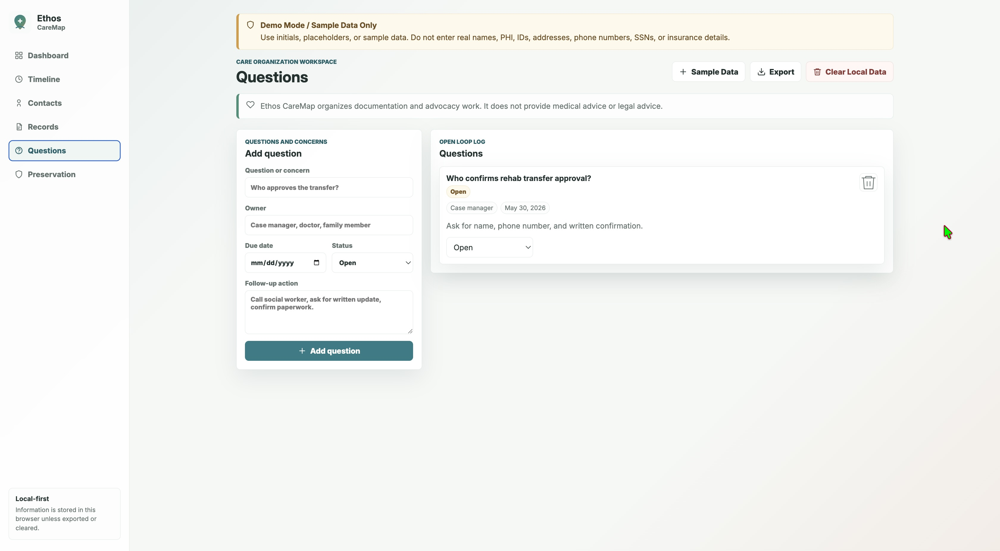
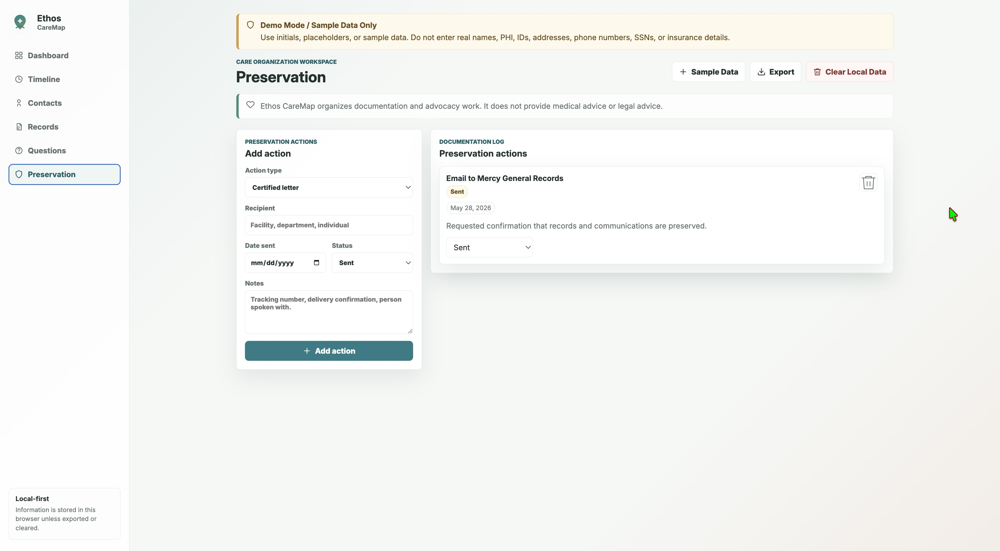

# Ethos CareMap MVP

Ethos CareMap helps families organize medical events, records, facilities, contacts, timelines, and next steps during health crises, caregiving journeys, rehabilitation stays, hospitalizations, hospice situations, and end-of-life circumstances.

Ethos CareMap organizes documentation and advocacy work. It does not provide medical advice or legal advice.

## Framework and Build Setup

- Framework: none. This is a static vanilla HTML, CSS, and JavaScript app.
- Runtime: browser only.
- Storage: `localStorage`, under the key `ethos-caremap-v1`.
- Backend: none.
- External database: none.
- Build command: `npm run build`.
- Build output: `dist/`.

## Privacy and Safety Guardrails

Ethos CareMap is a public demo and should be used with sample data only.

- Do not enter real names, PHI, medical record numbers, addresses, phone numbers, SSNs, insurance IDs, or highly sensitive details.
- Use initials, placeholders, or the built-in sample data.
- Information entered in the app is stored only in the current browser using `localStorage`.
- The app does not use a backend, external database, analytics, tracking, external API calls, or cloud upload.
- Exported JSON files are created locally by the browser. Users are responsible for storing exported files securely.
- The "Clear All Local Data" action removes app data from this browser, but it does not delete exported files.

## GitHub Pages Deployment

The app uses relative asset paths such as `styles.css`, `app.js`, and `assets/caremap-mark.svg`, plus hash-based in-page navigation. That means it works correctly from the GitHub Pages repository subpath:

`https://<your-github-username>.github.io/ethos-caremap-mvp/`

### Automatic Pages Deployment

1. Create a GitHub repository named `ethos-caremap-mvp`.
2. Upload or push this project to the repository.
3. In GitHub, go to `Settings` -> `Pages`.
4. Set the Pages source to `GitHub Actions`.
5. Push to the `main` branch.

The workflow at `.github/workflows/pages.yml` builds the static site and deploys the `dist/` folder.

### Manual Pages Deployment

Run:

```sh
npm run build
```

Then upload the contents of `dist/` to the branch or Pages source you use for static hosting.

## Local Development

Open `index.html` directly in a browser, or run:

```sh
npm run preview
```

Then visit:

`http://127.0.0.1:4173/index.html`

## Architecture Decisions

- Static single-page app: Version 1 uses HTML, CSS, and JavaScript without a frontend framework so the demo is easy to audit, host, and maintain.
- Local-first storage: No data is transmitted to a server. User-entered information stays in the browser unless exported or cleared.
- Subpath-safe routing: Navigation uses hash fragments, so GitHub Pages refreshes and direct links work under `/ethos-caremap-mvp/`.
- Derived dashboard: Counts and next actions are calculated from the source collections instead of duplicated as separate state.
- Feature-shaped state: `timeline`, `contacts`, `records`, `questions`, and `preservation` map directly to the MVP workflows.
- Accessible, calm UI: The visual system uses restrained healthcare-adjacent colors, readable spacing, clear forms, and visible status states.

## Files to Upload

For the source repository, upload:

- `index.html`
- `styles.css`
- `app.js`
- `assets/`
- `scripts/`
- `.github/`
- `package.json`
- `README.md`
- `CHANGELOG.md`
- `.gitignore`

For manual GitHub Pages hosting, upload the contents of `dist/` after running `npm run build`.

## Application Screenshots

The screenshots below represent the current GitHub Pages deployment (v0.2.0) using sample/demo data only.

## Live Demo

[Launch Ethos CareMap](https://codebytequill.github.io/ethos-caremap/)

## Dashboard



## Timeline



## Contacts



## Records



## Questions



## Preservation


